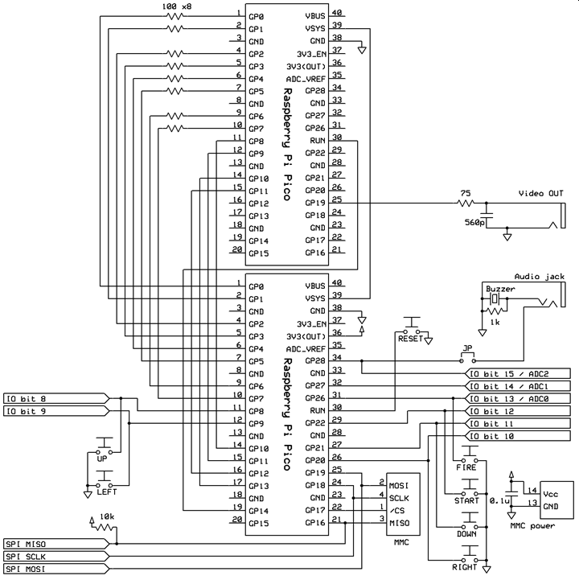

# mac_display
This directory contains the NTSC display projects connected to MachiKania type P.
## Microcontroller
Raspberry Pi Pico is used.
## Connection
The GP19 is the video out pin for NTSC display.  

## Compile
Use Arduino IDE with [ArduinoCore by earlephilhower](https://github.com/earlephilhower/arduino-pico).
## License
Basically, the code is written under the MIT license according to [the original code written by lovyan03](https://gist.github.com/lovyan03/b50333fa917371bd92b4b5f2e7a67e89). Thank lovyan03 for providing the code with MIT license.  
The font code is provided under the LGPL v2.1 license.
